# Smartphone Cover Shop

A multi-role Windows Forms desktop application built on **.NET Framework 4.7.2** and **Microsoft SQL Server**, providing dedicated portals for **Super Admin**, **Shop Owner (Admin)**, and **Customer**.

---

## Project Documentation

* 📄 **[Download / View the Final Project Report (PDF)](docs/Project_Report.pdf)**

---

## Team Members

| Serial | Name | Student ID | Contribution % | Contribution Details |
| :--- | :--- | :--- | :--- | :--- |
| 1 | Nahiyan | 24-58497-2 | 40% | Customer Dashboard, Shopping & Browsing, Cart & Checkout, Order Tracking, Documentation & Diagrams, Database Finalization |
| 2 | Zarif | 21-44568-1 | 30% | Admin Dashboard, Product Management, Offers & Promotions, Shop Profile, Initial Setup |
| 3 | Mashruf | 22-46073-1 | 30% | Super Admin Dashboard, User & Shop Management, Content Moderation, Database Architecture |

---

## Diagrams

* 🗄️ **[View Full SQL Schema Diagram](docs/diagrams/SQL_Schema_Diagram.md)**
* 🗺️ **[View UI Navigation Diagram](docs/diagrams/UI_Navigation_Diagram.md)**

### SQL Schema Diagram

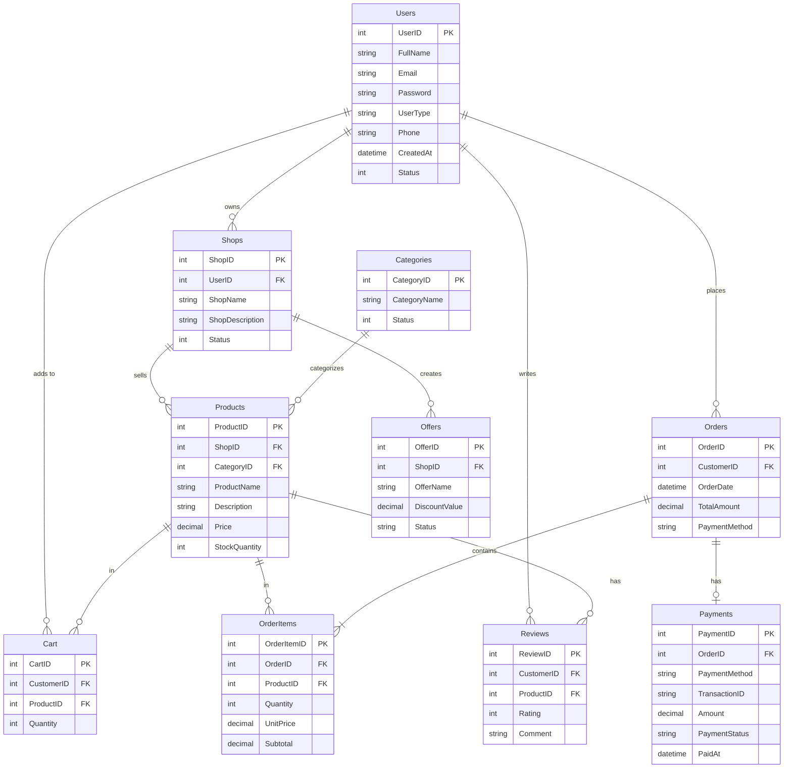

### UI Navigation Diagram

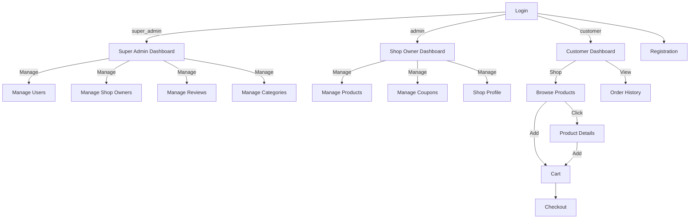

---

## Screenshots

### Core
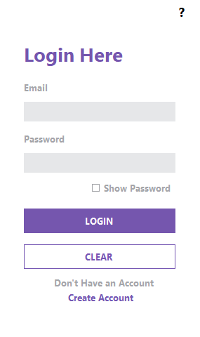
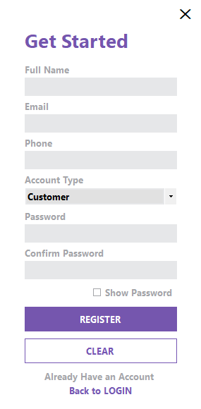

### Customer Portal
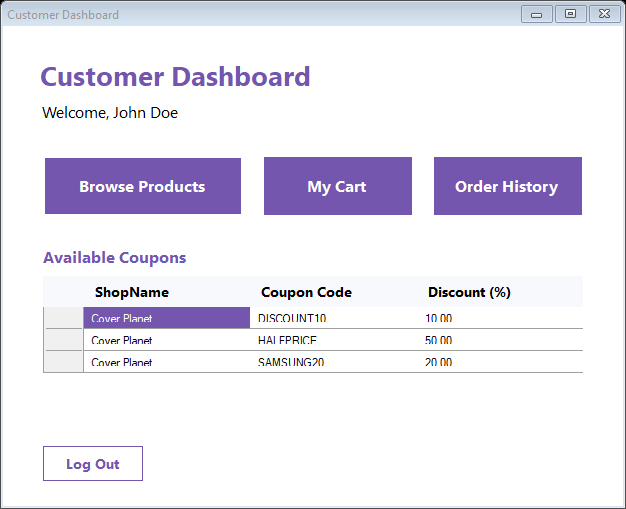
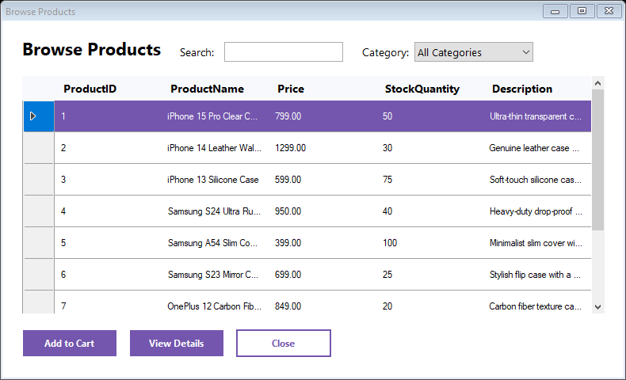
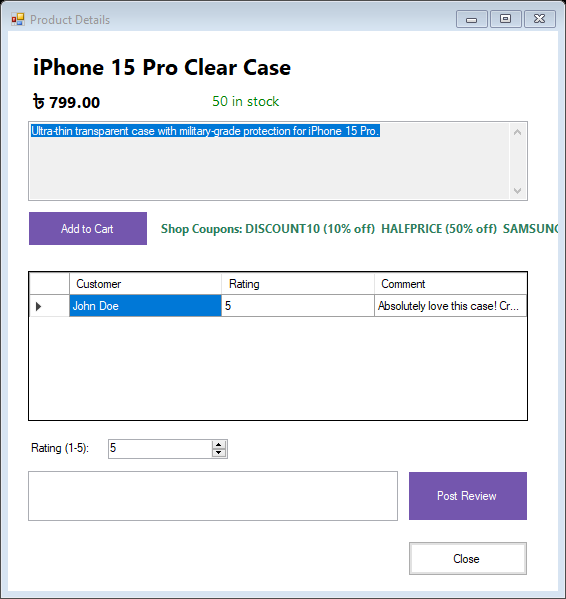
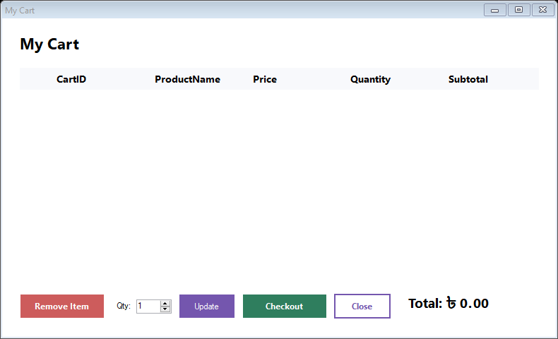
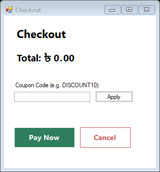
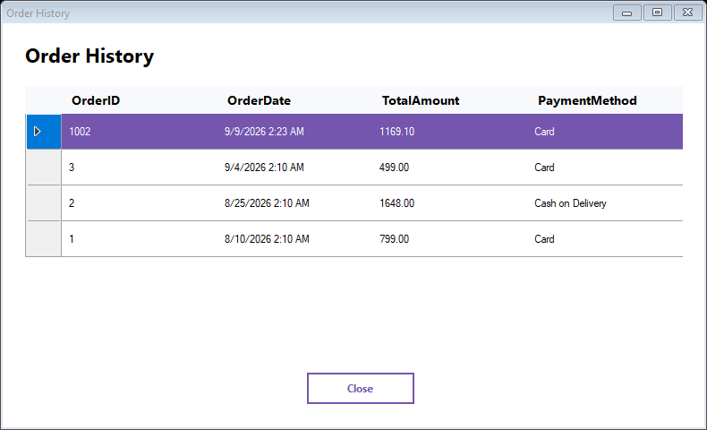

### Shop Owner (Admin) Portal
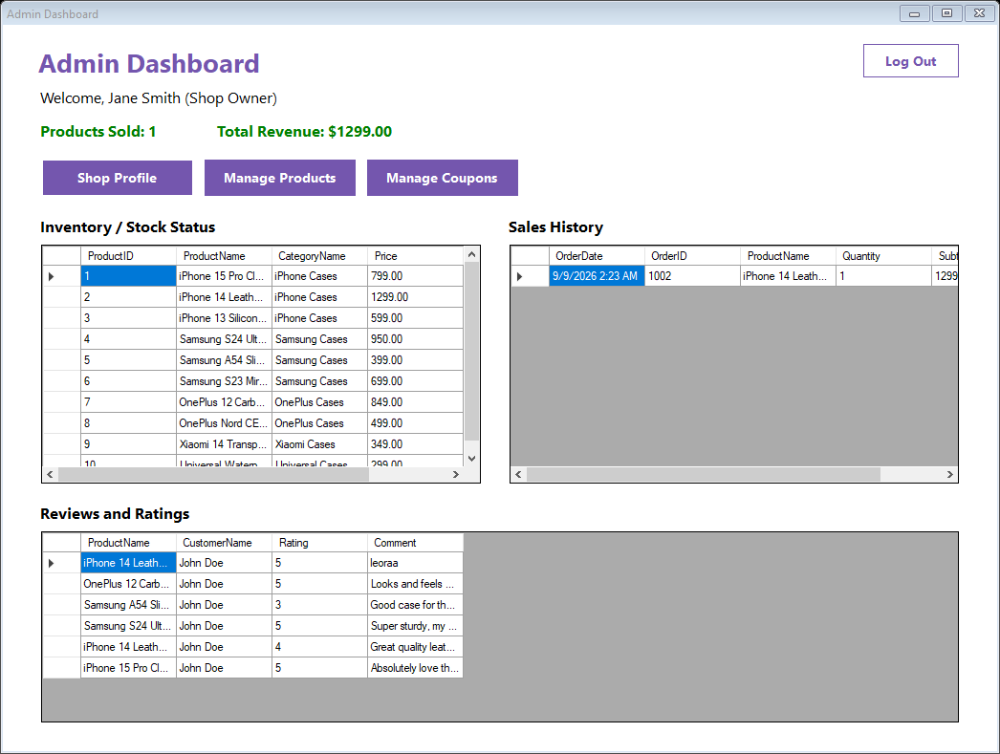
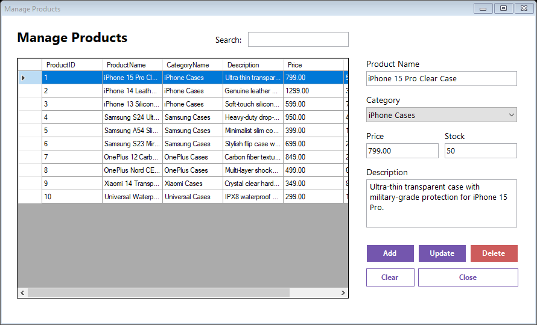
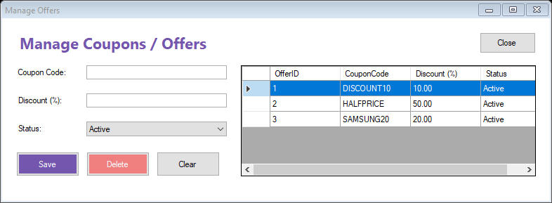
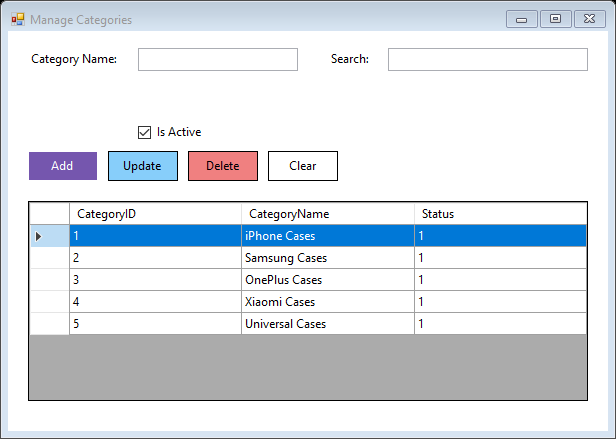
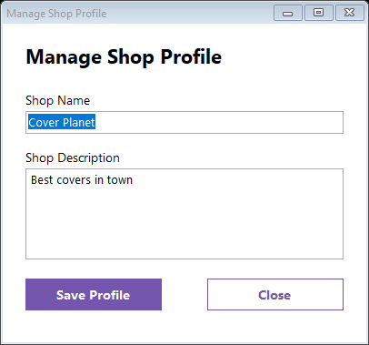

### Super Admin Portal
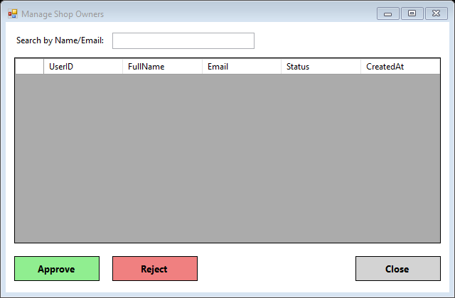
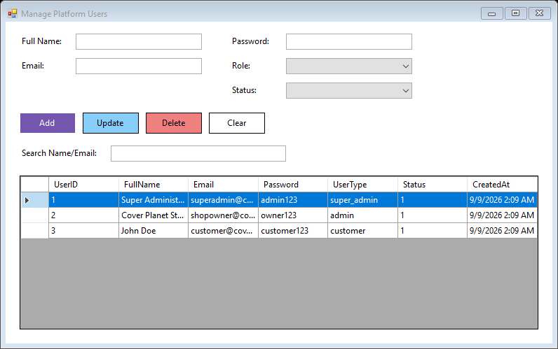
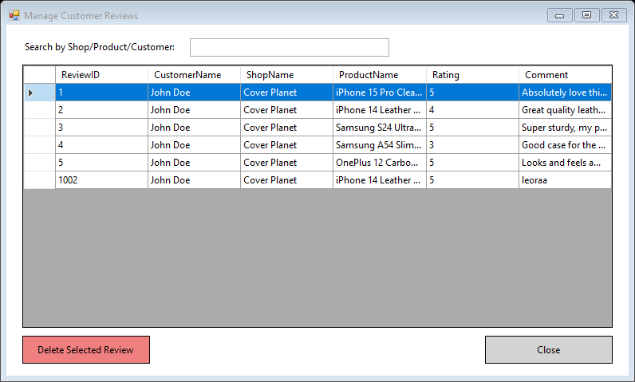

---

## Database Setup & Connection String

1. **Database Script:** The complete database schema, dummy data, and testing queries are all located in a single unified script: [`Database/dbo.Table.sql`](Database/dbo.Table.sql). Execute this in SQL Server Management Studio (SSMS) to create and seed the `SmartphoneCoverShopDB` database.
2. **Connection String:** To run the project locally, open `SmartphoneCoverShop\App.config` and change the `Data Source` in the connection string to match your local SQL Server instance name (e.g., `.` or `.\SQLEXPRESS`).

```xml
<connectionStrings>
    <add name="DefaultConnection" 
         connectionString="Data Source=.;Initial Catalog=SmartphoneCoverShopDB;Integrated Security=True" 
         providerName="System.Data.SqlClient" />
</connectionStrings>
```

---

## Pre-Seeded Test Accounts

| Role | Email | Password | Role Code |
| :--- | :--- | :--- | :--- |
| **Super Admin** | `superadmin@covershop.com` | `admin123` | `super_admin` |
| **Shop Owner** | `shopowner@covershop.com` | `owner123` | `admin` |
| **Customer** | `customer@covershop.com` | `customer123` | `customer` |