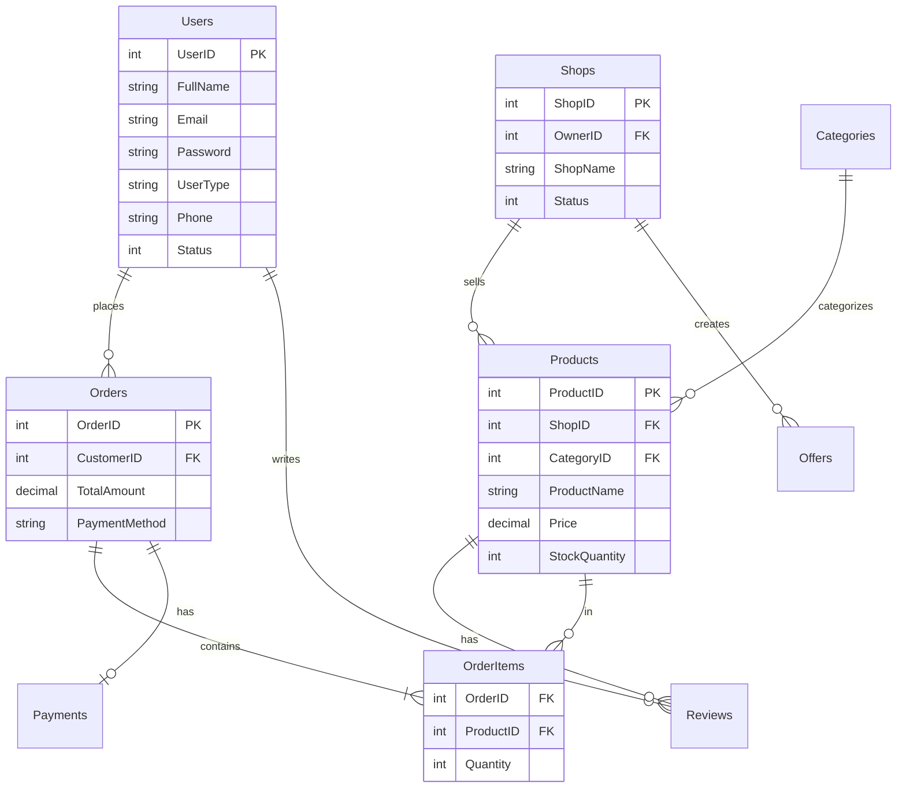
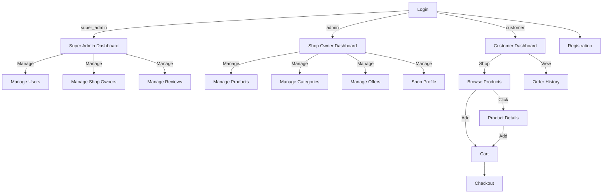

# Smartphone Cover Shop

A multi-role Windows Forms desktop application built on **.NET Framework 4.7.2** and **Microsoft SQL Server**, providing dedicated portals for **Super Admin**, **Shop Owner (Admin)**, and **Customer**.

---

## Project Documentation

* 📄 **[Download / View the Final Project Report (PDF)](Project_Report.pdf)**

---

## Team Members

| Name | Student ID | Contribution |
| :--- | :--- | :--- |
| Nahiyan | 10001 | Customer Dashboard, UI/UX, Cart & Checkout |
| Zarif | 10002 | Admin Dashboard, Product Management, Offers |
| Mashruf | 10003 | Super Admin Dashboard, Database Schema, User Roles |

---

## Diagrams

### SQL Schema Diagram

### UI Navigation Diagram

---

## Screenshots

### Core

### Customer Portal

### Shop Owner (Admin) Portal

### Super Admin Portal

---

## Database Setup

The complete database schema, dummy data, and testing queries are all located in a single unified script: [`dbo.Table.sql`](dbo.Table.sql).

---

## Pre-Seeded Test Accounts

| Role | Email | Password | Role Code |
| :--- | :--- | :--- | :--- |
| **Super Admin** | `superadmin@covershop.com` | `admin123` | `super_admin` |
| **Shop Owner** | `shopowner@covershop.com` | `owner123` | `admin` |
| **Customer** | `customer@covershop.com` | `customer123` | `customer` |