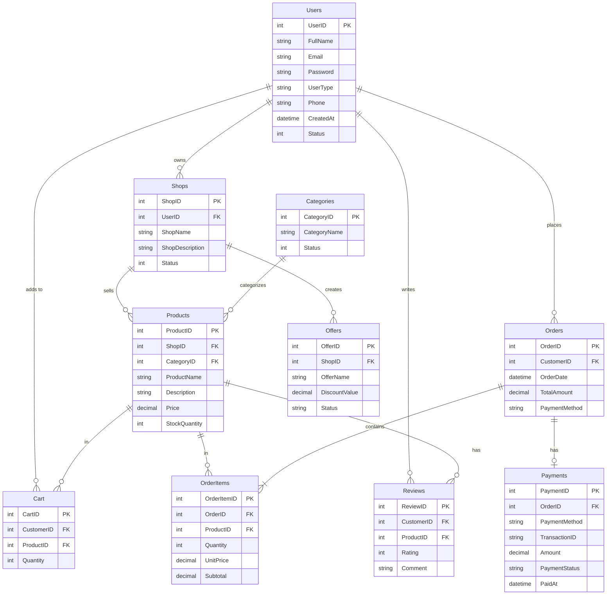

# SQL Schema Diagram

```mermaid
erDiagram
    Users ||--o{ Shops : "owns"
    Users ||--o{ Cart : "adds to"
    Users ||--o{ Orders : "places"
    Users ||--o{ Reviews : "writes"
    Shops ||--o{ Products : "sells"
    Shops ||--o{ Offers : "creates"
    Categories ||--o{ Products : "categorizes"
    Products ||--o{ Cart : "in"
    Products ||--o{ OrderItems : "in"
    Products ||--o{ Reviews : "has"
    Orders ||--|{ OrderItems : "contains"
    Orders ||--o| Payments : "has"

    Users {
        int UserID PK
        string FullName
        string Email
        string Password
        string UserType
        string Phone
        datetime CreatedAt
        int Status
    }
    Shops {
        int ShopID PK
        int UserID FK
        string ShopName
        string ShopDescription
        int Status
    }
    Categories {
        int CategoryID PK
        string CategoryName
        int Status
    }
    Products {
        int ProductID PK
        int ShopID FK
        int CategoryID FK
        string ProductName
        string Description
        decimal Price
        int StockQuantity
    }
    Cart {
        int CartID PK
        int CustomerID FK
        int ProductID FK
        int Quantity
    }
    Orders {
        int OrderID PK
        int CustomerID FK
        datetime OrderDate
        decimal TotalAmount
        string PaymentMethod
    }
    OrderItems {
        int OrderItemID PK
        int OrderID FK
        int ProductID FK
        int Quantity
        decimal UnitPrice
        decimal Subtotal
    }
    Payments {
        int PaymentID PK
        int OrderID FK
        string PaymentMethod
        string TransactionID
        decimal Amount
        string PaymentStatus
        datetime PaidAt
    }
    Reviews {
        int ReviewID PK
        int CustomerID FK
        int ProductID FK
        int Rating
        string Comment
    }
    Offers {
        int OfferID PK
        int ShopID FK
        string OfferName
        decimal DiscountValue
        string Status
    }
```
